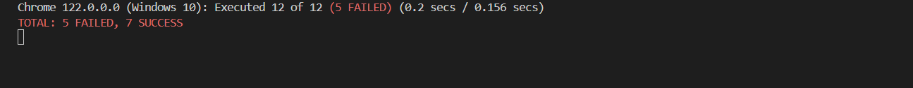

# Banco Pichincha Web Application

Banco Pichincha es el mayor banco privado de Ecuador. Este proyecto contiene una aplicación web diseñada para gestionar operaciones bancarias básicas con una interfaz de usuario amigable y eficiente.

## Table of Contents

- [Instalación](#instalación)
- [Configuración](#configuración)
- [Uso](#uso)
- [Características](#características)
- [Dependencias](#dependencias)
- [Licencia](#licencia)
- [Contacto](#contacto)

## Instalación

Para comenzar a usar esta aplicación, sigue estos pasos:

1. Clona este repositorio usando Git:
   git clone https://github.com/cristopher-dev/test-pichincha.git

2. Navega al directorio del proyecto clonado.

3. Ejecuta el comando `npm install` para instalar todas las dependencias necesarias.

## Configuración

Antes de iniciar la aplicación, asegúrate de configurar las variables de entorno y otras configuraciones necesarias siguiendo estos pasos:

2. Para iniciar la aplicación, ejecuta el siguiente comando:

Este comando arrancará un servidor local y abrirá la aplicación en tu navegador predeterminado.

npm start

## Uso

La aplicación soporta operaciones CRUD (Create, Read, Update, Delete) para gestionar datos bancarios. Estas operaciones se pueden realizar a través de la interfaz de usuario proporcionada por la aplicación web.

## Características

- **Gestión de Cuentas**: Permite a los usuarios crear, visualizar, actualizar y eliminar cuentas bancarias.
- **Interfaz Amigable**: Diseñada con Angular, proporcionando una experiencia de usuario fluida y reactiva.
- **Seguridad**: Implementa medidas de seguridad estándar para proteger los datos de los usuarios.

## Dependencias

Este proyecto depende de varias librerías y frameworks para su funcionamiento, incluyendo:

- Angular 16.2.0
- RxJS 7.8.0
- TypeScript 5.1.3

Para una lista completa de dependencias, por favor revisa el archivo `package.json` incluido en el repositorio.

## Licencia

Este proyecto está licenciado bajo la Licencia MIT. Para más detalles, ver el archivo `LICENSE` en el repositorio.

## Contacto

Si tienes preguntas o necesitas más información, por favor contacta a [cristopher](http://cristopher-dev.com/).

## test
5/7 test

